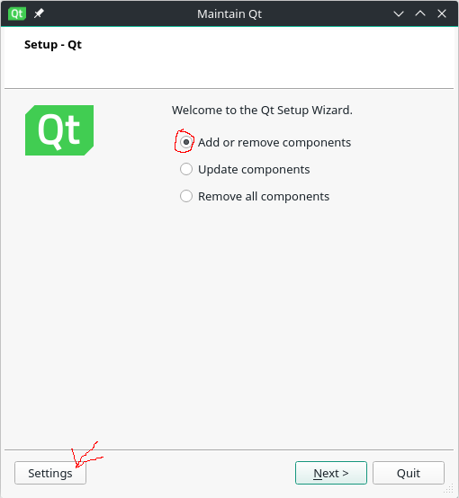
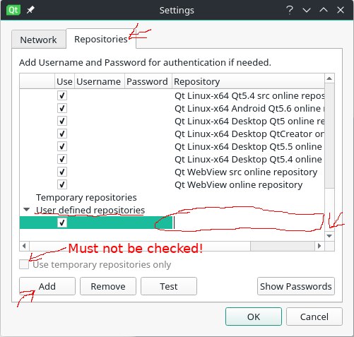
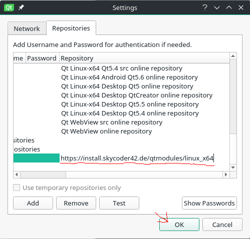
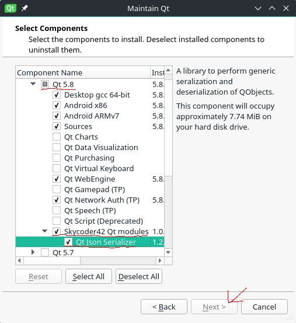

# QtModules
A module for the Qt Maintenance-Tool to add my modules to your Qt installation.

## Forked
I Forked this because I fored [qdep](https://github.com/Light-Wizzard/qdep), and making changes, some may not be good ones, for example, I never used docker, so I have no idea what I am changing, but I need to use my own Travis and AppVeyor accounts, so I need to figure this out.

## Add my repositories to Qt MaintenanceTool
This How-To explains how to add a custom repository to the Qt MainetenanceTool. This gives the advantage of an easy installation and maintenance of custom modules, and allows clean installations, deinstallations and updates.

## Add the repository

**Important:** Due to recent changes in the MaintenanceTool Version 3.0.5, the method below is broken. Instead, you must invoke the tool itself with as `/path/to/MaintenanceTool --addTempRepository https://install.skycoder42.de/qtmodules/<platform>`. This will add the repository for the current run the same way it should work via the GUI. Take the values for the path to the MaintenanceTool and the platform url from the part below.

There exists a bug report for the problem. See [QTIFW-1156](https://bugreports.qt.io/browse/QTIFW-1156).

-------

The first step is to actually add the repository to the mainetancetool. This can be done by adding it in the settings, as shown below. The MaintenanceTool can be found in your Qt installation folder. For example:
- Linux: `~/Qt/MaintenanceTool`
- Windows: `C:/Qt/MaintenanceTool.exe`
- MacOs: `~/Qt/MaintenanceTool.app`

First you open the Settings of the MaintenanceTool.

Now go to the repositories and add a new entry under the `User defined repositories` section. If you are using a newer version of the installer, that is disabled because the installer only uses temporary repositories. In that case, you have to
uncheck the `Use temporary repositories only` before you can add it. Please not that if thats the case for you, you will have to uncheck this box **every time** you start installer again. This is annoying, but sadly nothing can be done against this for now.

Enter the repository url and press ok. The url is:
- Linux: `https://install.skycoder42.de/qtmodules/linux_x64/`
- Windows: `https://install.skycoder42.de/qtmodules/windows_x86/`
- MacOs: `https://install.skycoder42.de/qtmodules/mac_x64/`

## Install the modules
Example shown on the [Qt Json Serializer](https://github.com/Skycoder42/QJsonSerializer) module, the procedure is the same for all my modules:

Select `Add or remove components` and start the setup

New entries will have appeared for each supported Qt Version, simply select the ones you want and proceed with the installation

